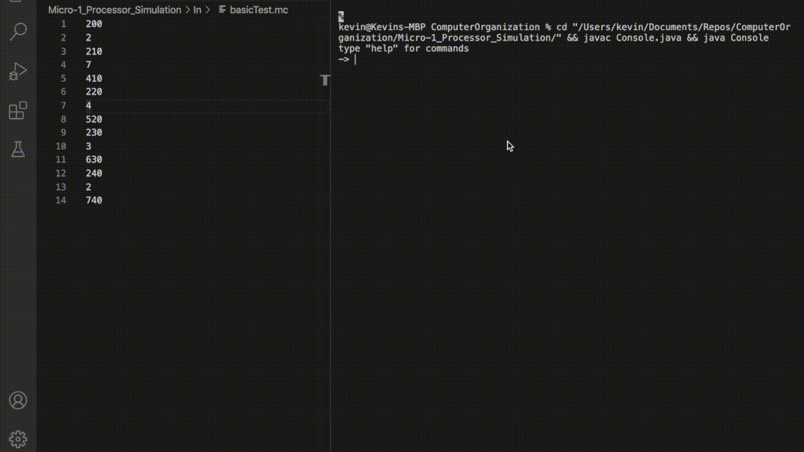

# -Micro-1-Processor-Simulation
Computer Organization Project 1

## Demo

### In Short
Implemented compiler, assembler and machine code reader in Java with GUI.

### Description
This was the final project of my Computer Organization class. The main objective of the project was to use Java to simulate a "Microprocessor" that is able to execute hexadecimal machine code. My main contribution was independently building the processor's assembler and compiler for a pseudo C language that implemented variables, basic operations, and loops. My teammates created an alternative to terminal, which was the GUI interface that can display the memory and registers as well as run the machine code line by line.
